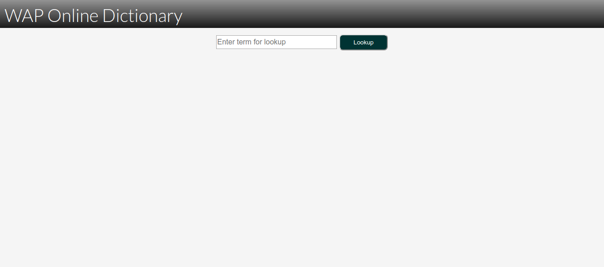
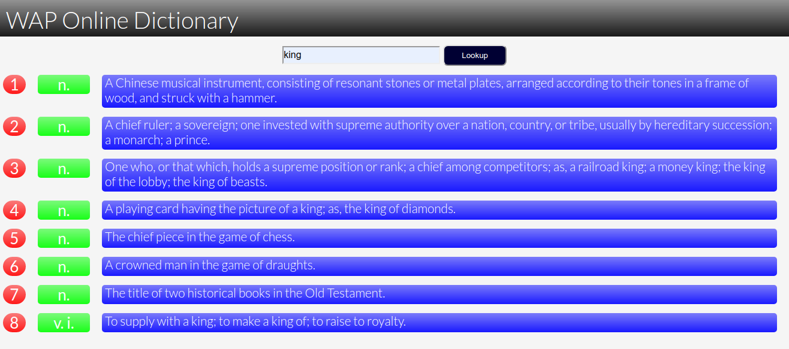
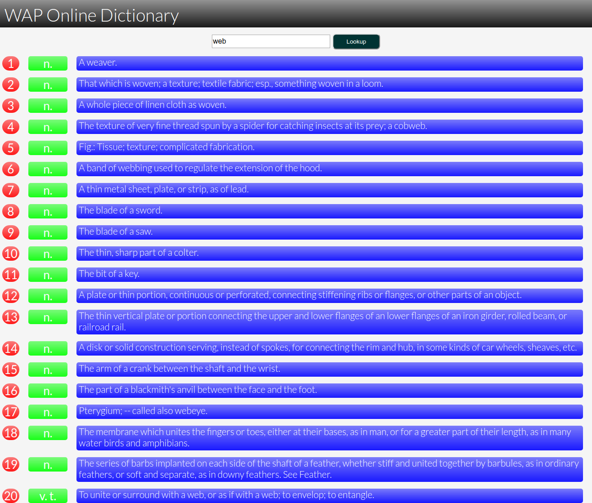

# Dictionary Project

- [Dictionary Project](#dictionary-project)
  - [Overview](#overview)
  - [Contributors](#contributors)
  - [Versions](#versions)
  - [Running this project](#running-this-project)
  - [Screenshots](#screenshots)

## Overview

Dictionary project is an web application that can be used to lookup for a certain word definition.

## Contributors

| Name | Email | Student ID |
| ---  | --- | --- |
| Mohamed Elalem | md.elalem@gmail.com | 610747

## Versions

| Name | Version |
| --- | --- |
| **Java** | 11.0.6 |
| **GlassFish** | 5.1.0 |
| **MySQL** | 8.0.19 |
| **PHPMyAdmin** | 5.0 |
| **Docker** | 19.03.7-ce |
| **Docker Compose** | 1.25.4 |

## Running this project

- Install **cmake**, **docker**, **docker-compose** then run the following commands:
  - `make up`
  - `make import`
- Unzip `./dictionary-project.zip` and import it in netbeans.
- **PHPMyAdmin** is available on `http://localhost:9090`

## Screenshots

